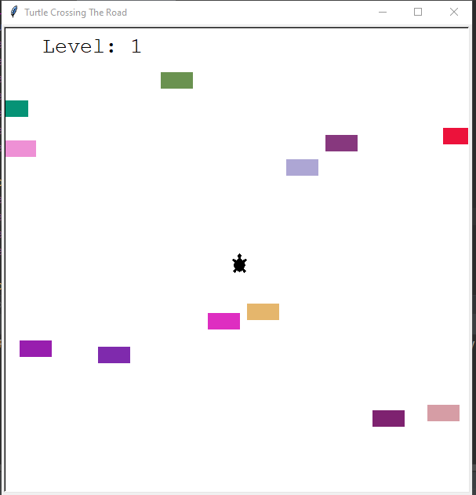

# Turtle Crossing The Road
A small game build using the turtle python library.

## How To Play The Game:
You can only use the "Up" key from the keyboard.
- If you touched the cars you loose.
- if you pass the road to the other side you get leve up.

## The Game Looks:

Have fun!
